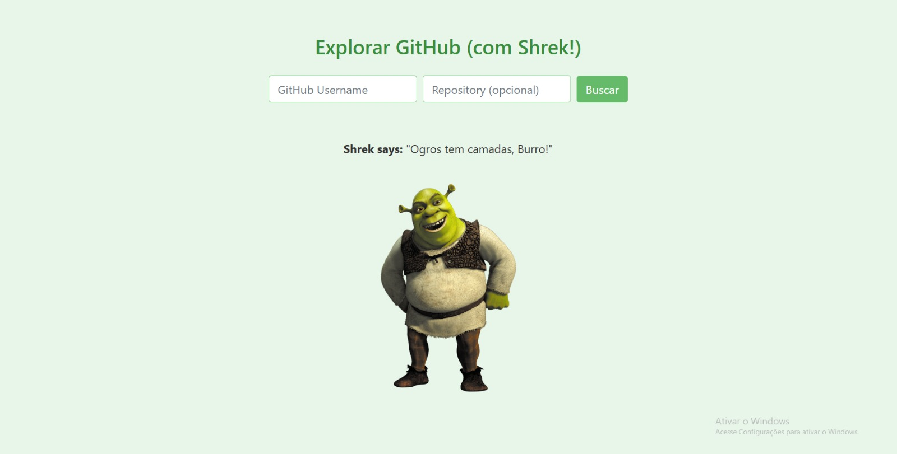

# Projeto2a: GitHub API e DOM Manipulation

.

#### Deploy

https://elc1090.github.io/project2a-2025a-joaofrigo/

#### Desenvolvedor(a)

João Marcos Wilhelms Frigo

#### Ambiente de desenvolvimento

VS Code

#### Créditos

(Imagem do shrek)
https://purepng.com/public/uploads/large/purepng.com-shrek-smileshrekcomputer-animatedfantasy-filmfairy-talebook-1701528653697k0vcj.png

#### Bastidores

Foi levemente complicado inicialmente por causa do uso do github pages. Não havia usado ainda. Mas depois que peguei o jeito, foi só questão de fazer o javascript funcionar corretamente com minhas mudanças no domínio criado. No caso, estava dando alguns problemas em relação ao carregamento imprevisto do script antes do html, foi resolvido usando DOMS, mais especificamente "document.addEventListener("DOMContentLoaded", function ())".

Depois desses contextos iniciais, só fiz algumas modificações básicas de CSS para modificar a vibe do site e coloquei nosso amigão da vizinhança Shrek para nos acompanhar em nossa aventura vasculhando o github (usando a nova função também de repositório).  

---
Projeto entregue para a disciplina de [Desenvolvimento de Software para a Web](http://github.com/andreainfufsm/elc1090-2025a) em 2025a
